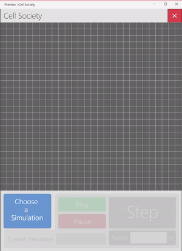

Cell Society Team 05 DESIGN_PLAN
===
### Authors
Jeremy Chen, jc587
Maya Messinger, mm479
Erik Riis, evr4

## Introduction

* This project is an animation of several cellular automata (CA) simulations. Provided a type of CA simulation and its conditions for maintaining/changing cell states (so far simulation types are Game of Life, predator-prey, segregation, and fire spreading), dimensions of a 2D grid in which the cells will be displayed, and initial starting states of cells, the program should iteratively update cell states and animate the updates for an undefined number of cycles.
* Some design goals of the project include writing code that is flexible, meaning that it is written without knowing the exact details of the next steps beforehand. The code should be written in such a way that it will be able to easily handle later parts being added on. Another goal includes writing clean code that is formatted and structured consistently while adhering to modern coding standards. 
* The primary architecture of this CA design will include several abstract classes - at least Cell, Runner, and Simulation. Following the idea of “open for extension, closed for modification”, there will be a large use of abstraction and subclasses. Each class should be closed to method modifications and have dynamic methods that create subclasses instead of case statements. Individual subclasses should implement their own version of an abstract method, so only Superclass.method() needs to be called and no code needs to be edited in order to implement new features.

### Overview

* public class Runner extends Application{} - main class that manages UserInterface, Simulation, and Viewer
* public void play()
	* public void step()
	* public void pause()
* public class Rules{} - XML parsing class that initializes the simulation and the grid
	* public Simulation buildSim(File xmlFile)
	* private ArrayList<Cell> getInitCells (String cellPos)
* public abstract class Simulation{} - subclasses of Simulation will control updating of cells in its instance of Grid with traits/values specific to simulation type (e.g. ConwaySim, FireSim, etc)
	* public static final Neighborhood neighbor; // Will have an subclass of Neighborhood appropriate for the simulation type
* public Simulation(Grid g)
	* each sim type has HashMap<String, Color> states that passes to Cell
	* public void update() // Creates copy of Grid, updates each cell according to neighbors & the specific simulation’s rules, and replaces current grid with copy when all Cell states have been updated
* public class Grid{} - holds Cells
	* private HashMap<String, Color> states;
	* private Cell[][];
	* public Grid(int width, int height, ArrayList<Cell> cells, HashMap<String, Color> availableStates)
* public int getWidth()
	* public int getHeight()
	* public void insert(int x, int y, Cell c)
	* public Cell getCell(int x, int y)
	* public void setState(int x, int y, String state)
		getCell(x,y).setFill(states.get(state);
	* init(ArrayList<Cell> cells)
* public abstract Viewer - Paints a Grid onto a Scene
	* public Viewer(Grid g, Scene s)
* public Cell extends Shape{} - not abstract, will only have 1 type of cell that each kind of Simulation makes, to avoid parallel hierarchies
	* Color color;
* private int x;
	* private int y;
	* public Cell(int x, int y, Color c)
	* public int getX()
	* public int getY()
	* public Color getColor()
* public interface Neighborhood{} - subclasses based on how simulations define what a neighbor is
	* public ArrayList<Cell> getNeighbors(Grid g, int x, int y){}
* public class userInterface{} - This class deals with the user interface components of the project from mouse/keyboard inputs
	* handles exceptions
	* handles toolbar, file selection
	* handles mouse input
	* handles keyboard input

### User Interface

The user interface will consist of six main elements:
1. **Choose a Simulation**: This is the first button the user should click. All other features are greyed out and not available until the user chooses an XML file for a simulation. As seen in the above images, when the button is clicked, a window will appear, prompting the user to choose an XML file in the file system. We will use FileChooser with an ExtensionFilter to provide the GUI when the user clicks browse available XML files in their filesystem. Our program will validate the file, and if it is valid, the user has use of the other UI elements. If the XML is invalid, another window (using vMenu) will appear, prompting the user to choose another XML file.
2. **Current Simulation**: This simply displays the current simulation that is loaded into the program.
3. **Play**: This button is enabled when the simulation is not playing, and a proper simulation has been loaded. It will run the simulation at the selected frame rate.
4. **Pause**: This button is enabled (not greyed out) when the simulation is currently playing. Pressing this button will pause the simulation.
5. **Step**: This button is enabled (not greyed out) when the simulation has not been played yet, or is currently paused. It will proceed one step in the simulation when pressed.
6. **Speed**: The user can input a positive integer value to determine how many frame updates they would like per second. This feature affects the refresh rate when the simulation is “Playing”. The default Speed is 1 frame per second.
	
### Design Details

* public class Runner extends Application{} - main class that manages userInterface, Rules, Simulation, and Viewer. Starts off by calling Rules to import information from the XML file, and that call puts the rest of the process (making a Simulation) into motion.
* public class Rules{} - parses XML file (throwing exception if formatted improperly), and generates an ArrayList of Cells that represent the starting conditions of the Grid, which Rules also makes
* public abstract class Simulation{} - subclasses of Simulation will control updating of cells in its instance of Grid with traits/values specific to simulation type (e.g. ConwaySim, FireSim, etc). Is one of the smartest class, as it manager Grid (which manages Cells), updates (method calls but, not visually), and passes Cells the states they can possibly have based on the simulation
* public class Grid{} - holds Cells, and modifies them individually. Can retrieve their values (state, color), check indices, and sets their states when Simulation calls update() method.
* public abstract Viewer - Paints a Grid onto a Scene
* public Cell extends Shape{} - not abstract, will only have 1 type of cell that each kind of Simulation makes, to avoid parallel hierarchies. Not a very smart class, has variables and getter methods. Cells aren’t meant to be modified, just to hold information to animate.
* public interface Neighborhood{} - subclasses based on how simulations define what a neighbor is and what cells factor into another cell changing/keeping state
* public class userInterface{} - This class deals with the user interface components of the project from mouse/keyboard inputs. Anything the user interacts with directly is handled here.

### Use Cases
* Middle cell: Our instance of Simulation has an update() method, which when called will get the neighbors of all cells in an instance of Grid, create a copy of the Grid, where every cell is updated, and replace the original Grid with the new Grid. We have a specific subclass of Neighborhood that is a constant in the given Simulation. The getNeighbors(Grid g, int x, int y) method from that class is called, with Grid and the x & y indices of the cell (retrievable with c.getX() & c.getY()) are passed through. getNeighbors() will return an ArrayList of Cells that neighbor the given cell. Our update() method will count the number of live cells (determined by iterating through the ArrayList returned by getNeighbors() and counting the number of live cells, interpreted with a c.getColor() call).
* Edge cell: getNeighbors() has built-in logic to prevent (basically catch) an IndexOutOfBounds exception. Because getNeighbors() knows cell’s index, and grid’s size, any index that’s 0 shouldn’t check -1, and max row/col index shouldn’t check beyond number of rows/cols
* Next generation: Runner calls play(), which calls sim.update(), which calls grid.setCell() based on getNeighbors() values
* Set sim parameter (based on XML file): Using javafx’s FileChooser, and filtering for only XML files, Rules class (method parseXML) parses data and stores values (sim type, grid size, starting cell conditions)
* Switch simulations: Player uses UI to load new simulation (choose new XML file to load), build a totally new Simulation and trashing the old Simulation

### Design Considerations

Before we start working on creating the project, design considerations we need to address or have addressed are as follows.
* We need to define how to implement cell states in different simulations (alive, dead, color, on fire, etc). Because the list of possible types of cells is not static, we need to abstract state as an aspect of each Cell, and determine what information the method holds while maintaining the ability to implement new types of simulations or conditions. Previously we had thought that State would be its own class, but realized that making it an object wouldn’t really serve any purpose, and to make it a variable in each cell was better.
* Determining what classes specific methods should be in has taken a lot of time for us. We have ideas of some methods that should exist and do x, but determining the best class to place these methods in took a lot of time to decide/agree on.
* What class should hold the actual Scene that contains the animation (makes sense for Runner to have the Scene, but calling the objects on the scene happens repeatedly from other classes - should we put the Scene inside whichever class calls the objects most?). We have a Viewer class that refreshes the Scene (enacts step), but we also could make a Scene within Grid, or even as something called from Rules.
* What should be the function of Cell? Despite Cell being the foundation of this project, we kind of think it better for Cell to just have a few simple variables - currState, nextState and color - and other classes are the smart classes that act upon cells. At what level should changing cell state be implemented? We’re still deciding if the grid should modify the cells placed within it, as it can access indices (therefore surrounding cells) more easily than individual cells can. For scalability, implementing a feature that affects many things might be done at the level of a larger object. Or, because there are so many Cells, each one having methods that call on conditions that affect their state would be helpful.
* How do we handle getNeighbors() method? Because the definition of neighbor is not just “adjacent to current cell”, what class makes the most sense for implementation? Can cells access cells around the Grid? Does it make more sense for the grid to access all its cells and do a check rather than a cell calling up to its grid and then looking back down to check individual cells?

Assumptions/dependencies:
* It seems like Rules will need to have an if tree that creates different types of Simulations based on something like “if xmlfile.simType = this”. This means that we will only be able to implement a whitelist of grids, and the Rule class will throw errors if any formatting within the XML file is unsupported.

### Team Responsibilities

Planning on taking 2-3 days to delegate responsibilities and figure out how our respective classes will work together (keeping method and variable names consistent). Check-in meeting to see progress of everyone - comfort with their work and classes that they’re assigned and discussing how to get classes to work together in a more serious way, since progress has started. Check-in on weekend (start of weekend) to finalize and fix bugs, polish product.

Front end: userInterface, Viewer
Back end: Grid, Cell, Rules, Runner, Simulation, Neighborhood

#### Maya
* Simulation class and subclasses
* Cell class

#### Erik
* UserInterface
* Viewer

#### Jeremy
* Rules, Neighborhood, Grid, Runner